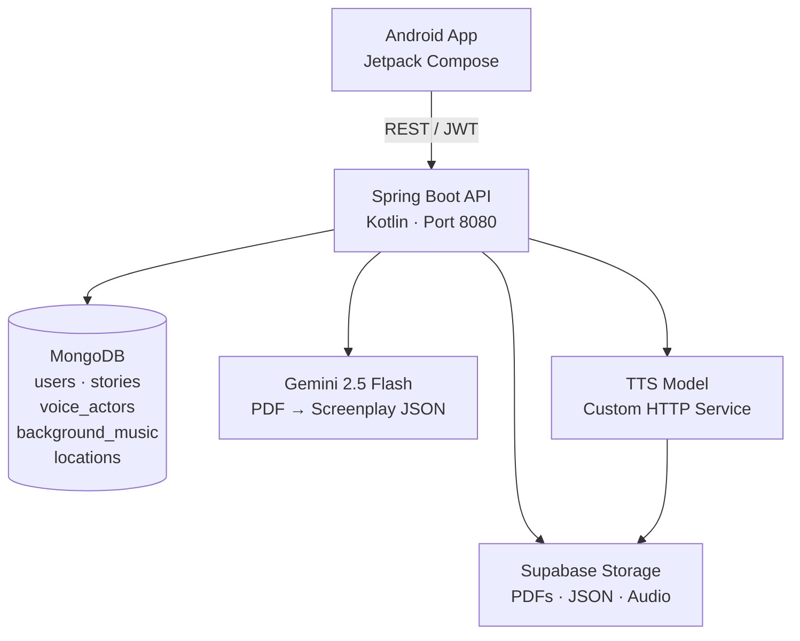
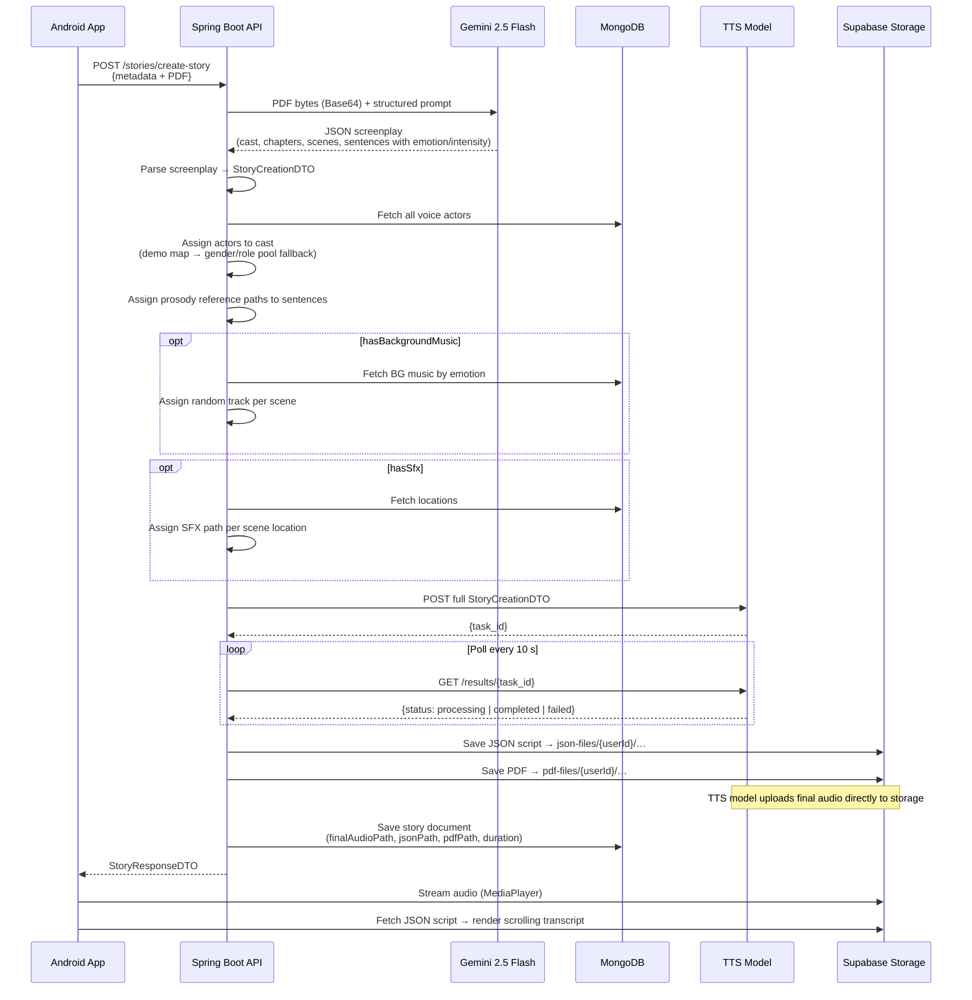

# 📖 StoryAlive

**StoryAlive** is a graduation project that transforms Egyptian Arabic PDF stories into fully produced audiobooks. A user uploads a PDF, and the platform automatically extracts a screenplay, assigns voice actors to each character, synthesizes speech with per-sentence emotion control, layers in location sound effects and background music, and returns a single mixed audio file with a synchronized scrolling transcript.

---

## ✨ Features

- **PDF-to-Audiobook pipeline** — upload an Arabic story as a PDF and receive a complete mixed audio production
- **Gemini 2.5 Flash story extraction** — structured JSON screenplay (cast, chapters, scenes, sentences) produced from raw PDF content
- **Emotion-aware TTS** — each sentence carries an `emotion` (HAPPINESS, SADNESS, ANGER, FEAR, SURPRISE, WHISPER, NARRATION) and `intensity` (LOW / MEDIUM / HIGH) that drives voice rendering
- **Automatic voice casting** — Gemini-extracted characters are matched against the voice actor pool by gender, age group, and preferred role
- **Background music assignment** — scene-level emotion (ROMANTIC, TENSE, TRAGIC, MYSTERIOUS, TRIUMPHANT, PEACEFUL, ENERGETIC) selects a random matching track from the library
- **Location sound effects** — 18 recognised location enums (COFFEE\_SHOP, BEACH, MOSQUE, RAIN, …) are resolved to SFX paths and mixed into the output
- **Per-sentence audio editing** — after generation, any sentence can be re-rendered with a different emotion/intensity without regenerating the whole story
- **Public / private story visibility** — stories are scoped per user; private stories are only visible to their creator
- **Custom voice actors** — users can record or upload a 3–5 second audio sample to create a personal voice actor (public or private)
- **JWT authentication** — access token (30 min) + refresh token (30 days) with hashed token storage; full logout invalidation
- **Supabase cloud storage** — PDFs, JSON scripts, and voice actor audio samples are stored in configurable buckets
- **Paginated story browsing** — public stories, private stories, favourites (API-ready), and history (API-ready)
- **Profile management** — view account statistics and edit personal details including password change

---

## 🏗️ System Architecture



The backend is stateless; all session state lives in JWT tokens. MongoDB stores document metadata. Files (PDFs, JSON scripts, reference audio) live in Supabase. The Gemini API and the TTS model are called synchronously over HTTP — the TTS call uses a task-ID polling loop that will wait up to 24 hours for the model to finish.

---

## 🔄 Workflow



---

## 🛠️ Tech Stack

### Frontend
| Technology | Version | Purpose |
|---|---|---|
| Kotlin | JVM 11 | Primary language |
| Jetpack Compose | BOM (compileSdk 36) | Declarative UI |
| Retrofit2 | 2.9.0 | HTTP client |
| OkHttp3 | 4.12.0 | HTTP transport + logging interceptor |
| Gson | 2.10.1 | JSON serialisation |
| Coil Compose | 2.5.0 | Async image loading |
| Android MediaPlayer | — | Audio playback |
| Android MediaRecorder | — | In-app voice recording |
| SharedPreferences | — | JWT token persistence |

### Backend
| Technology | Version | Purpose |
|---|---|---|
| Kotlin | JVM 17 | Primary language |
| Spring Boot | 4.0.3 | Web framework |
| Spring Security | — | JWT filter chain |
| Spring Data MongoDB | — | Document persistence |
| JJWT | 0.12.6 | JWT generation & validation |
| OkHttp3 | 4.12.0 | Gemini & TTS HTTP calls |
| Jackson Kotlin | 2.15.2 | JSON mapping |
| SpringDoc OpenAPI | 2.8.5 | Swagger UI |
| Ktor Client | 2.3.4 | Supabase REST transport |

### Database
| Technology | Purpose |
|---|---|
| MongoDB | All document storage (users, stories, voice\_actors, background\_music, locations) |

### Cloud Storage
| Technology | Purpose |
|---|---|
| Supabase Storage | PDF files, JSON story scripts, voice actor audio samples, final mixed audio |

### AI & External Services
| Service | Purpose |
|---|---|
| Google Gemini 2.5 Flash | PDF parsing → structured screenplay JSON (cast + scenes + per-sentence emotion) |
| Custom TTS Model | Converts `StoryCreationDTO` to a mixed audio file with prosody references |

---

## 📁 Project Structure

```
StoryAlive/
├── Backend/
│   └── StoryAlive/StoryAlive/
│       └── src/main/kotlin/com/StoryAlive/StoryAlive/
│           ├── Controllers/          # REST entry points
│           │   ├── AuthController.kt
│           │   ├── StoryController.kt
│           │   ├── VoiceActorController.kt
│           │   ├── BGMusicController.kt
│           │   ├── LocationController.kt
│           │   ├── UserController.kt
│           │   └── EnumsController.kt
│           ├── Services/             # Business logic
│           │   ├── StoryService.kt
│           │   ├── GeminiService.kt
│           │   ├── TTSService.kt
│           │   ├── AuthService.kt
│           │   ├── SupabaseStorageService.kt
│           │   ├── LLMService.kt     # Legacy HuggingFace path (commented out)
│           │   ├── UserService.kt
│           │   ├── VoiceActorService.kt
│           │   ├── BGMusicService.kt
│           │   └── LocationService.kt
│           ├── Models/               # MongoDB documents
│           │   ├── Story.kt
│           │   ├── User.kt
│           │   ├── VoiceActor.kt
│           │   ├── Audio.kt
│           │   ├── BackgroundMusic.kt
│           │   ├── Location.kt
│           │   └── RefreshTokens.kt
│           ├── DTOs/                 # Request / response shapes
│           │   └── Story/
│           │       ├── StoryCreationDTO.kt
│           │       ├── StoryRequestDTO.kt
│           │       ├── StoryScript.kt
│           │       ├── GeminiDTO.kt
│           │       ├── TTSResponse.kt
│           │       ├── ChapterDto.kt
│           │       ├── SceneDto.kt
│           │       ├── SentenceDto.kt
│           │       ├── CastDto.kt
│           │       └── ...
│           ├── Repositories/         # MongoDB CRUD interfaces
│           ├── Security/             # JWT filter, config, BCrypt wrapper
│           ├── Enums/                # Genre, Tags, Emotion, Intensity, Gender, ...
│           ├── Mappers/              # Story ↔ DTO, User ↔ DTO
│           ├── GeminiConfig.kt
│           ├── HttpClientConfig.kt
│           └── JacksonConfig.kt
│
└── frontend/
    └── StoryAlive/app/src/main/java/com/example/storyalive/
        ├── LoginActivity.kt
        ├── SignUpActivity.kt
        ├── UploadActivity.kt          # Main story creation screen
        ├── StoryActivity.kt           # Audio player + scrolling transcript + edit dialog
        ├── PublishedActivity.kt       # Grid of public/published stories
        ├── privateStoriesActivity.kt  # Grid of user's private stories
        ├── ProfileActivity.kt
        ├── VoiceActorActivity.kt      # Create a voice actor (record or upload)
        ├── EditProfileActivity.kt
        ├── SettingsActivity.kt
        ├── components/
        │   └── StoryAliveHeader.kt    # Top navigation bar with dropdown menu
        ├── model/                     # Data classes mirroring API DTOs
        ├── network/
        │   ├── apiService.kt          # Retrofit interface
        │   ├── retrofitClient.kt      # OkHttp + auth interceptor factory
        │   └── RequestUtils.kt        # Multipart helper
        └── utils/
            └── FileUtils.kt           # URI → File conversion
```

---

## ⚙️ Backend Architecture

### Controllers

| Controller | Base Path | Responsibility |
|---|---|---|
| `AuthController` | `/auth` | Register, login, token refresh, logout |
| `StoryController` | `/stories` | Create, read, update stories; public/private/history feeds |
| `VoiceActorController` | `/voice-actors` | CRUD for voice actors; public, private, all-available |
| `BGMusicController` | `/bg-music` | Seed background music library |
| `LocationController` | `/location` | Seed location SFX library |
| `UserController` | `/user` | Get profile, edit profile |
| `EnumsController` | `/enums` | Expose Genre, Tags, Emotion values to clients |

### Services

**`StoryService`** — orchestrates the entire pipeline: Gemini extraction → cast assignment → BG music assignment → SFX assignment → TTS generation → Supabase upload → MongoDB persistence.

**`GeminiService`** — encodes the PDF as Base64, sends it to `gemini-2.5-flash:generateContent` with a constrained JSON schema, and parses the response into a `StoryScript`. The schema enforces typed enums for emotion, intensity, location name, gender, and preferred role. A `buildFinalOutput` method normalises the raw Gemini response, auto-inserts the narrator "راوي" if missing, and assigns stable sentence IDs.

**`TTSService`** — POSTs the fully-resolved `StoryCreationDTO` to the TTS model, receives a `task_id`, then polls `GET /results/{task_id}` every 10 seconds until status is `completed`, `failed`, or the 24-hour timeout elapses. The same polling pattern is used for single-sentence re-rendering via `PUT /update-story-audio`.

**`SupabaseStorageService`** — uploads and downloads files via Supabase's REST storage API using OkHttp. Handles PDFs (`files` bucket), JSON scripts (`files` bucket), and voice actor audio samples (configurable bucket). Returns the public URL of every uploaded file.

**`AuthService`** — BCrypt password hashing, JWT issuance, SHA-256 hashed refresh token storage in MongoDB, single-session enforcement (previous refresh tokens are deleted on every new login or token refresh).

### Security

`JwtAuthFilter` sits in front of every non-`/auth/**` endpoint. Access tokens live for 30 minutes; refresh tokens for 30 days. Tokens are validated by type claim to prevent refresh tokens being used as access tokens.

### Data Models

| Collection | Key Fields |
|---|---|
| `users` | `userId`, `email` (unique), `password` (BCrypt), `favouriteStories`, `historyStories`, story/actor counters |
| `stories` | `storyId`, `creatorId`, `voiceActors` (map actor ID → actor name / character name pair), `finalAudioPath`, `jsonPath`, `pdfPath`, `duration`, `isPrivate` |
| `voice_actors` | `voiceActorId`, `actorName`, `gender`, `isAdult`, `isPrivate`, `audios` (list of `Audio(emotion, intensity, filepath)`) |
| `background_music` | `musicId`, `musicPath`, `emotion` (BGMusicEmotion), `forKids` |
| `locations` | `locationId`, `locationName` (LocationName enum), `sfxPath`, image path |
| `refresh_tokens` | `userId`, `hashedToken` (SHA-256), `expiresAt` |

---

## 📱 Frontend Architecture

The Android app is written in Kotlin with Jetpack Compose. There is no ViewModel layer — API calls are dispatched directly from composables or Activity `LaunchedEffect` blocks using `CoroutineScope(Dispatchers.IO)`. JWT tokens are persisted in `SharedPreferences` (`app_prefs`) and injected as a `Bearer` header by an OkHttp interceptor in `RetrofitClient`.

### Screens

| Screen | Activity | Description |
|---|---|---|
| Login | `LoginActivity` | Email/password → `POST /auth/login` → stores tokens → navigates to Upload |
| Sign Up | `SignUpActivity` | Registration form with genre/tag preferences → `POST /auth/register` |
| Upload | `UploadActivity` | 4-step card form: PDF picker, story metadata, voice actor selection (paginated, infinite scroll), audio options → `POST /stories/create-story` |
| Story Player | `StoryActivity` | `MediaPlayer` audio playback with seek slider, volume control, scrolling transcript synced by word-count proportion, per-sentence edit dialog |
| Published Stories | `PublishedActivity` | Paginated grid of public stories; tapping a card navigates to the Story Player |
| Private Stories | `privateStoriesActivity` | Same grid layout for the user's private stories |
| Voice Actor Creator | `VoiceActorActivity` | In-app microphone recording (3–5 s enforced) or file upload → `POST /voice-actors` |
| Profile | `ProfileActivity` | User stats, private voice actor list, edit profile inline |

### Navigation

Navigation is Activity-based (no Jetpack Navigation component in the active code). The `StoryAliveTopBar` composable renders a `TopAppBar` with a `DropdownMenu` linking to Upload, Published, Private, Profile, and Settings. FavoriteStoriesActivity and HistoryActivity exist in the source but are commented out of the navigation menu.

### Audio Player

`StoryActivity` initialises an `android.media.MediaPlayer` from `story.finalAudioPath` (a Supabase public URL) using `prepareAsync`. Transcript synchronisation is approximate: sentence duration is estimated by its word-count proportion of total audio duration. The current sentence is highlighted and auto-scrolled via `LazyListState.animateScrollToItem`.

---

## 🤖 AI Components

### Gemini 2.5 Flash — Story Extraction

`GeminiService.extractStory(pdfBytes)` is the primary AI integration. Three OCR approaches were evaluated (EasyOCR at ~77 s, Tesseract at ~136 s, Gemini at ~30 s); Gemini was chosen for speed and accuracy on Arabic text with diacritics.

- The PDF is Base64-encoded and sent as `inlineData` alongside a system prompt that instructs Gemini to act as a "cinematic story understanding engine"
- The response is constrained to a strict JSON schema: cast array with `gender`, `isAdult`, and `preferredRole`; chapters containing scenes with `location`, `scene_emotion`, and `segments` (speaker, sentence, emotion, intensity)
- Location names are expected as English enum keys; an Arabic→enum fallback map handles cases where Gemini returns Arabic text
- The narrator character "راوي" is always guaranteed to exist in the output
- Before settling on Gemini, the team fine-tuned Qwen-2.5-1.5B-Instruct with LoRA for structured JSON extraction; Gemini was ultimately adopted because it handled literary nuance and implicit context more reliably

### Tag-EGTTS — TTS Model & FastAPI Service

The TTS module runs as a standalone **FastAPI** service inside a **Kaggle** notebook, exposed externally via **Ngrok**. This was chosen after discovering that CPU-only HuggingFace Spaces took ~3 hours to produce 3 minutes of audio; a single Kaggle GPU node reduced that to ~1 minute.

**Model:** Tag-EGTTS — fine-tuned from EGTTS (itself based on XTTS / Tortoise architecture) on a custom dataset of **1,983 audio recordings** from **155 speakers** covering 7 emotions × 3 intensity levels, collected from Egyptian cartoon movies and team-organized recording sessions.

**Emotion tagging:** each sentence is prepended with two special tokens before inference:
```
<emo_happiness> <int_mid> النص العربي هنا
```
Ten tokens were added to the vocabulary (7 emotion + 3 intensity tags). The model learns to condition prosody on these tags without pronouncing them.

**"Dual Mode" behaviour:** when the reference audio is emotionally neutral, the model renders the emotion from the text tags. When the reference audio already carries a strong emotion, that emotion dominates. This lets the system generate a wider range of expressiveness from a single neutral recording per speaker.

**MOS evaluation (29 participants):**
| Model | Average MOS |
|---|---|
| Tag-EGTTS (with tags) | 3.54 |
| Base EGTTS (no fine-tuning) | 3.01 |

Overall emotion recognition accuracy improved from 43.3% (base) to 53.0% (Tag-EGTTS), with the largest gains in happiness (+47 pp), whisper (+41 pp), and surprise (+25 pp).

**TTS service endpoints:**

| Method | Path | Description |
|---|---|---|
| `POST` | `/tts/` | Submit full `StoryCreationDTO`; returns `{task_id}` immediately |
| `GET` | `/tts/results/{task_id}` | Poll for status (`processing` / `completed` / `failed`) |
| `POST` | `/tts_test/` | Single-sentence test: form-data with `text`, `audio_file`, `emotionName`, `intensity` |

**Pipeline inside the TTS service (`run_tts_pipeline`):**
1. Download all prosody reference WAVs, SFX, and BG music from Supabase concurrently (with an in-memory cache to avoid duplicate fetches)
2. For each sentence, prepend emotion/intensity tags and call `inference_by_model()` — which uses `model.get_conditioning_latents()` to extract speaker embeddings and `model.inference()` at `temperature=0.65`
3. Save per-sentence WAVs in a hierarchical folder: `outputs/{storyId}/{chapterId}/{sceneId}/{sentenceId}.wav`
4. Concatenate with `pydub`: chapter title → scenes → sentences; overlay SFX (at scene start) and loop BG music (volume attenuated ~15 dB below narration); add 2 s silence between scenes and 3 s between chapters
5. Export as MP3 at 192 kbps, upload to the `story-audio-files` Supabase bucket, and store the public URL in the task result

**Model files** are loaded from a Kaggle dataset (`mariamelkondakly/emoeg-tts`) at paths:
```
/kaggle/input/models/mariamelkondakly/emoeg-tts/other/emoeg-tts/1/
  config.json
  vocab.json
  model.pth
```

### Voice Casting Logic

Each `CastDto` from Gemini carries `gender`, `isAdult`, and `preferredRole`. Actors are indexed into a pool keyed by `VoiceActorKey(isAdult, gender, preferredRole)`. A hardcoded demo name-map (Arabic character name → actor name) takes priority so that known recordings are always used for specific characters; unmatched characters fall back to the typed pool. The `prosodyReference` path for each sentence is then set to the matching `Audio.filepath` from that actor's emotion/intensity matrix, with graceful fallbacks across intensities.

---

## 🔌 API Overview

### Authentication — `/auth`
| Method | Path | Description |
|---|---|---|
| `POST` | `/auth/register` | Create account, returns `{accessToken, refreshToken}` |
| `POST` | `/auth/login` | Credential login, returns token pair |
| `POST` | `/auth/refresh` | Exchange refresh token for new token pair |
| `POST` | `/auth/logout` | Invalidate all refresh tokens for the caller |

### Stories — `/stories`
| Method | Path | Description |
|---|---|---|
| `GET` | `/stories?pageNumber=0&pageSize=10` | Paginated public stories |
| `GET` | `/stories/{storyId}` | Single story (adds to history) |
| `GET` | `/stories/private` | Caller's private stories |
| `GET` | `/stories/favourites` | Caller's favourite stories |
| `GET` | `/stories/history` | Caller's listening history |
| `POST` | `/stories/create-story` | Multipart: `storyRequestDTO` (JSON part) + `file` (PDF) |
| `PUT` | `/stories/{storyId}/sentences/{sentenceId}` | Re-render one sentence with new emotion/intensity |
| `POST` | `/stories/{storyId}` | Re-run TTS on an existing story (dev utility) |

### Voice Actors — `/voice-actors`
| Method | Path | Description |
|---|---|---|
| `GET` | `/voice-actors` | Public voice actors (paginated) |
| `GET` | `/voice-actors/private` | Caller's private voice actors |
| `GET` | `/voice-actors/all-user-available` | Public + caller's private (paginated) |
| `POST` | `/voice-actors` | Multipart: `request` (JSON) + `files` (audio samples) |
| `POST` | `/voice-actors/list` | Bulk create with files |
| `POST` | `/voice-actors/list-DB` | Bulk create metadata only (no files) |

### User — `/user`
| Method | Path | Description |
|---|---|---|
| `GET` | `/user` | Get current user profile |
| `PUT` | `/user/edit` | Update name, email, age, or password |

### Supporting
| Method | Path | Description |
|---|---|---|
| `GET` | `/enums/all` | Returns `{genre, tags, emotions}` as string lists |
| `GET` | `/location` | Paginated location list |
| `POST` | `/location` | Multipart: location metadata + image/audio file |
| `POST` | `/bg-music` | Seed a background music entry |

---

## 🚀 Installation

### Prerequisites

- **Backend**: JDK 17, Gradle, MongoDB instance, Supabase project
- **Frontend**: Android Studio with API 29+ device or emulator

### Backend

```bash
cd Backend/StoryAlive/StoryAlive
# Set environment variables (see Configuration section)
./gradlew bootRun
```

Swagger UI is available at `http://localhost:8080/swagger-ui/index.html`.

### Frontend

1. Open `frontend/StoryAlive` in Android Studio
2. Update `BASE_URL` in `RetrofitClient.kt` to point to your backend
3. Run on a device or emulator (minSdk 29)

### Database

MongoDB auto-creates collections on first write (`spring.data.mongodb.auto-index-creation=true`). Seed background music and locations using the admin endpoints before processing stories.

---

## 🔧 Configuration

All backend secrets are supplied as environment variables. The following are required:

```env
# MongoDB
MONGO_URI=mongodb+srv://<user>:<pass>@<cluster>.mongodb.net/<db>

# JWT
JWT_SECRET_BASE64=<base64-encoded 32+ byte secret>

# Supabase
SUPABASE_URL=https://<project-ref>.supabase.co
SUPABASE_KEY=<service-role key>
SUPABASE_BUCKET=<default bucket name>

# Google Gemini
gemini-api-key=<your Gemini API key>
# Base URL is hardcoded to gemini-2.5-flash:generateContent

# TTS Model
TTS_MODEL_URL2=<base URL of your TTS service, e.g. http://tts-host:port>

# Legacy (unused in current code path)
AI_MODEL_URL=<HuggingFace LLM endpoint>
```

---

## ▶️ Running the Project

```bash
# 1. Start MongoDB (local or Atlas)

# 2. Export environment variables
export MONGO_URI="mongodb://localhost:27017/storyalive"
export JWT_SECRET_BASE64="<your base64 secret>"
export SUPABASE_URL="https://xxx.supabase.co"
export SUPABASE_KEY="<service key>"
export SUPABASE_BUCKET="voice-actors"
export gemini-api-key="<gemini key>"
export TTS_MODEL_URL2="http://your-tts-server"

# 3. Start the backend
cd Backend/StoryAlive/StoryAlive
./gradlew bootRun

# 4. Seed reference data (optional, needed for SFX/BGMusic features)
# POST /bg-music/list with emotion-tagged music entries
# POST /location/list with location SFX entries

# 5. Open the Android project in Android Studio
# Update BASE_URL in RetrofitClient.kt
# Run on device or emulator
```

---

## 🧭 Design Decisions

**Gemini instead of a local LLM.** The codebase contains a legacy `LLMService` that called a HuggingFace-hosted model. The active `createStory` path bypasses it entirely in favour of `GeminiService`, which offers constrained JSON schema output — critical for reliable downstream parsing.

**Synchronous TTS polling on the server.** Rather than returning a job ID to the client and having the app poll, the backend holds the HTTP connection open and polls the TTS model internally. This simplifies the Android client at the cost of long-running server threads. The Tomcat connection timeout is set to 24 hours to support this.

**Activity-based navigation.** The frontend uses traditional Android Activities rather than a single-Activity Navigation Component setup. Each screen is an independent Activity, which fits the linear flow of the app (login → upload → player) without complex back-stack requirements.

**Supabase as a file store only.** The project does not use Supabase's authentication, realtime, or database features — only its object storage. All auth and data logic lives in the Spring Boot backend and MongoDB.

---

## 🔮 Future Improvements

- Replace the synchronous TTS polling approach with an async webhook or message queue to free server threads
- Add a real listening history and favourites UI (API endpoints exist; the Android Activities are stubbed but commented out of navigation)
- Implement playback speed control (UI buttons are rendered but the `MediaPlayer.playbackParams` calls are not wired)
- Add token refresh logic on the Android client (the refresh endpoint exists but the interceptor does not auto-retry 401s)
- Extract environment-specific configuration into Spring profiles for dev/staging/prod
- Support multi-language stories beyond Arabic

---

## 🔗 Links & Resources

| Resource | Link |
|---|---|
| 📦 GitHub Repository | [GP-PowerpuffGirls/StoryAlive](https://github.com/GP-PowerpuffGirls/StoryAlive) |
| 🖥️ Kaggle TTS Notebook | [storyalive-v2](https://www.kaggle.com/code/mariamelkondakly/storyalive-v2) |
| 🤗 HuggingFace Organization | [ttsEmo](https://huggingface.co/ttsEmo) |
| ☁️ Google Drive (experiments & fine-tuning) | [Drive folder](https://drive.google.com/drive/folders/1uo3cJyNw_A2T3zGhlCBX7OsXUL43of7d?usp=sharing) |

### 🧠 Model Checkpoints

| Model | Description | Link |
|---|---|---|
| Tag-EGTTS (final) | Full-architecture fine-tuned model with emotion + intensity tags | [Kaggle](https://www.kaggle.com/models/mariamelkondakly/emoeg-tts/) |
| Narration-only fine-tuned | GPT-encoder fine-tuned on narration audio only | [Kaggle](https://www.kaggle.com/datasets/mariakaiser/narration-only-finetuned-model) |
| Emotions-only fine-tuned | GPT-encoder fine-tuned on emotional audio only | [Kaggle](https://www.kaggle.com/datasets/mariakaiser/xtts-model) |
| All-data fine-tuned | GPT-encoder fine-tuned on combined narration + emotion dataset | [Kaggle](https://www.kaggle.com/datasets/mariakaiser/all-data-emo-and-narr-ft) |


---

## 👥 Contributors

Ain Shams University — Faculty of Computer & Information Sciences, Computer Science Department (July 2026)

| Name | Email |
|---|---|
| Mariam Elkondakly | mariamelkondakly88@outlook.com |
| Menna Mohamed | menna.mohamedd2023@gmail.com |
| Christine Medhat | Christin.medhat2003@gmail.com |
| Habiba Hamed | hamedhabiba217@gmail.com |
| Maria Kaiser | mariakaiser2024@gmail.com |
| Nora Ahmed | Noraahmedcs@gmail.com |

**Supervisors:** Dr. Mohamed Mabrouk (Assistant Professor) · AL. Aya Saad (Assistant Lecturer)

---

## 📄 License

This project is released under the [MIT License](LICENSE).
